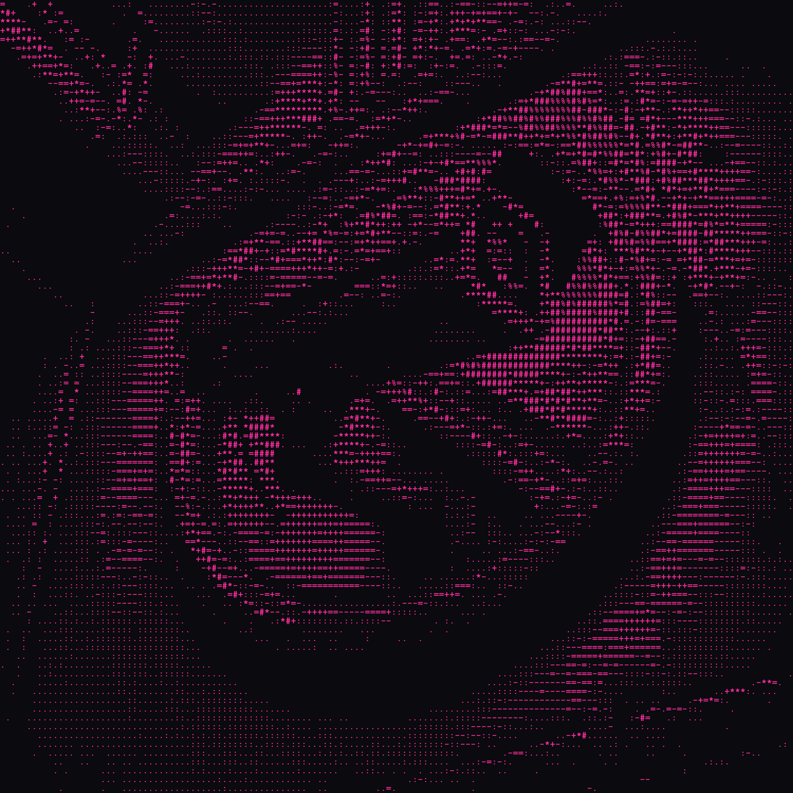

# Cam Sniffer
Esp32 OUI Sniffer

This project uses a Seedstudio Xiao esp32-C3 to scan for a specific OUI or group of OUIs via ble. 
If the specified device is detected, a message is sent to the Heltec Lora V3 and distributed over a LoRa mesh network such as Meshtastic.

## Requirements
- Seedstudio Xiao esp32-C3
- Heltec Lora V3
- Meshtastic framework or other lora mesh framework
- Current Nimble library for BLE intergration
- You need other devices on your mesh channel to recieve the alerts from this device. I highly reccomend using a Sensecap Lorawan Card Tracker from Seeedstudio
 https://www.seeedstudio.com/SenseCAP-Card-Tracker-T1000-E-for-Meshtastic-p-5913.html

## Setup
1. Edit **Line 74** in `meshdetect.ino`, replacing `00:11:22` with the OUI(s) of your target devices.
2. If are not using the Mesh Detect pcb, connect pins Rx 19 and Tx 20 of the Heltec board to Tx D4 and Rx D5 on the Xiao esp32 board.
3. Flash meshdetect.ino to your Xiao board via Arduino IDE.
4. Flash your Heltec board with latest Meshtastic firmware at [flasher.meshtastic.org](https://flasher.meshtastic.org) and set reagion to US
5. In Meshtasic app, configure your Heltec device serial module settings:
   - TextMessage
   - 115200 baud
   - Pins: Rx 19 and Tx 20 on the Heltec board
   

## Serial Connection

## Usage
1. Put device on mesh channel of your choice. 
2. Power the device via the Xiao ESP32 USB-C port. Ble scanner will continiously sends a serial message over meshtastic if your target device/devices are detected

## Contributing
Fork the repository and use a feature branch. Pull requests welcome.

## Order a PCB for this project

